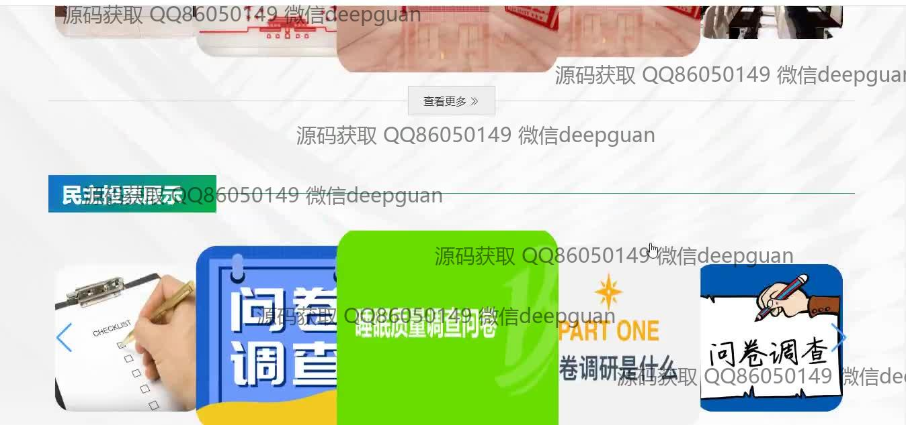
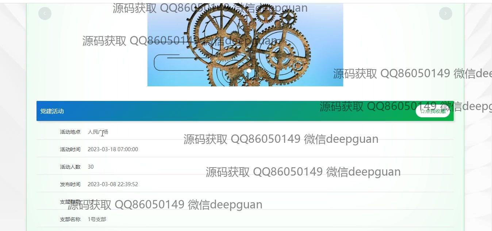

<h1 align="center">智慧党建系统设计与实现</h1>

## 简介
智慧党建系统：角色分为管理员、用户；功能包括党员管理、党支部管理、党建活动管理、问卷调查、民主投票、学习测试以及党建学习与收藏等模块，实现全面的党建数字化管理和互动。    --计算机毕业设计源码；毕设源码；java毕业设计源码

## 联系方式

<h3 align="center">获取完整代码与数据库文件 + 微信：deepguan QQ: 86050149 QQ群: 783742310</h3>

<h3 align="center">可帮忙远程部署 包运行成功！提供远程部署、修改代码、设计文档指导、代码讲解等服务！</h3>

## 功能介绍（完整见运行截图）
管理员：管理员在智慧党建系统中具备党支部、党员、党建活动等模块的管理权限。可以进行党支部信息录入和管理，包括账号、负责人和联系方式等。可管理党建活动信息和组织投票，监控试题和考试记录，编辑党建要闻并设置发布时间。支持多样化的问卷创建和管理，包含问卷调查与问卷回答。 提供党费管理和活动报名审核功能，确保系统全面运作。

党支部负责人：负责党支部的基本信息维护，如支部名称、负责人和地址等。可以管理支部党员的基本信息，录入并更新党员的年龄、性别、学历等资料。开展支部活动的组织与管理，包括活动信息发布、活动报名管理，审核报名状态等。参与党建要闻编辑与发布，协助党建学习模块的应用，促进党员间的学习和互动。

党员：可以通过个人中心管理个人信息，并参加系统组织的各类活动和学习测试。可参与问卷调查和民主投票，在系统中获取党建要闻和学习资源。能够查看并维护个人的考试记录和错题本，查询和报名参加支部组织的活动。支持党费在线缴纳管理，维护与支部和党建活动的有效连接。

访客：访客可以浏览系统首页，查看党建要闻和展示的活动信息。能够参与公开的问卷问答和民主投票，通过系统直观地了解党建动态和知识。可以查看系统展示的党建地图和党建学习模块，获取相关信息。系统的公开部分对访客开放，支持简化的交互，提高对外的展示效果。

## 运行截图

本代码来源于网络,仅供学习参考使用!

